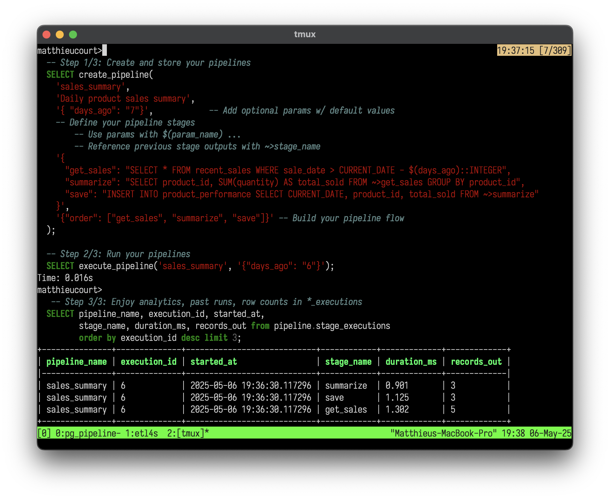

<p align="center">
  
</p>

#  pg_pipeline
**Write pipelines inside Postgres**

A lightweight PostgreSQL library to build, store and run pipelines directly in your database 🐘🪄.
Part of [d4](https://github.com/mattlianje/d4)

## Features
- Simple JSON-based pipeline definition
- Zero dependencies, no external tools
- Config-driven pipelines
- Reference previous stage results with `#`
- Dry run mode to preview resolved SQL without executing
- Parameter validation catches undefined `$(param)` references
- Execution stats, row counts for free

## Get started
```bash
make install      # install into your database
make test         # run the test suite
make sandbox      # drop into a psql session with pg_pipeline loaded
```
Or just:
```sql
\i pg_pipeline.sql
```

## How it works

The simple API has just two functions
1. `create_pipeline()` defines a pipeline.
2. `execute_pipeline()` runs it.

```sql
SELECT create_pipeline(
  'daily_revenue',                          -- name
  'Aggregate revenue by product per day',   -- description
  '{"lookback": "7"}',                      -- parameters with defaults
  '{
    "orders":   "SELECT * FROM orders WHERE created_at > CURRENT_DATE - $(lookback)",
    "revenue":  "SELECT product_id, SUM(total) AS rev FROM #orders GROUP BY 1",
    "snapshot": "INSERT INTO revenue_daily SELECT CURRENT_DATE, product_id, rev FROM #revenue"
  }',
  '{"order": ["orders", "revenue", "snapshot"]}'
);
```

```sql
-- run with default params
SELECT execute_pipeline('daily_revenue');

-- override params at runtime
SELECT execute_pipeline('daily_revenue', '{"lookback": "30"}');
```

### Stage references

Each stage stores its results in a temp table. Reference it with `#stage_name`:

```sql
SELECT user_id, SUM(amount) FROM #filtered_orders GROUP BY 1
```

`#` resolves to the actual temp table at execution time (word-boundary safe - `#orders` won't clobber `#orders_backup`).

### Parameters

String-substituted before execution. Define defaults in `create_pipeline`, override in `execute_pipeline`:

```sql
SELECT * FROM events WHERE ts > NOW() - INTERVAL '$(hours) hours'
```

### Dry run

Preview the resolved SQL without executing:
```sql
SELECT jsonb_pretty(execute_pipeline('daily_revenue', '{"lookback": "14"}', true));
```

Returns every stage's SQL with `#` and `$(...)` fully substituted. Nothing is executed, nothing is logged.

### Validation

Catches errors before any SQL runs:
- **Parameter validation** - `$(typo_param)` raises an error if the param doesn't exist
- **Flow/stage consistency** - stages missing from `flow.order` (or vice versa) are rejected at creation time

## Querying runs
You can view all current pipelines and/or their stages and history with the views:
```
pipeline.list
pipeline_history(<NAME>, <# of pipelines>)
pipeline.stage_executions
pipeline.status
```

```sql
-- all defined pipelines
SELECT * FROM pipeline.list;

-- recent runs (one row per execution)
SELECT * FROM pipeline_history('daily_revenue');
SELECT * FROM pipeline_history();              -- all pipelines, last 10
SELECT * FROM pipeline_history(NULL, 50);      -- all pipelines, last 50

-- stage-level detail
SELECT * FROM pipeline.stage_executions WHERE pipeline_name = 'daily_revenue';

-- aggregate stats
SELECT * FROM pipeline.status;
```

## Real-world example: dashboard rollup

A pipeline that powers a Grafana/Metabase dashboard. Computes daily active users, segments them by cohort, and materializes a summary table your BI tool queries directly.

```sql
-- Source tables: events(user_id, event_type, ts), users(user_id, signup_date, plan)

SELECT create_pipeline(
  'dash_daily_engagement',
  'Daily user engagement rollup for dashboards',
  '{"target_date": "CURRENT_DATE - 1"}',

  -- stages
  '{
    "active_users": "
      SELECT DISTINCT user_id, DATE(ts) AS activity_date
      FROM events
      WHERE DATE(ts) = $(target_date)
        AND event_type != ''pageview''
    ",
    "with_cohort": "
      SELECT a.user_id, a.activity_date, u.plan,
             DATE_PART(''day'', a.activity_date - u.signup_date)::int AS days_since_signup
      FROM #active_users a
      JOIN users u USING (user_id)
    ",
    "rollup": "
      INSERT INTO dash_engagement (activity_date, plan, cohort_bucket, active_users, pct_of_total)
      SELECT activity_date, plan,
             CASE WHEN days_since_signup < 7  THEN ''first_week''
                  WHEN days_since_signup < 30 THEN ''first_month''
                  ELSE ''mature''
             END AS cohort_bucket,
             COUNT(*) AS active_users,
             ROUND(COUNT(*)::numeric / SUM(COUNT(*)) OVER (PARTITION BY activity_date), 4) AS pct_of_total
      FROM #with_cohort
      GROUP BY 1, 2, 3
      ON CONFLICT (activity_date, plan, cohort_bucket) DO UPDATE
        SET active_users = EXCLUDED.active_users,
            pct_of_total = EXCLUDED.pct_of_total
    "
  }',

  '{"order": ["active_users", "with_cohort", "rollup"]}'
);

-- Backfill the last 7 days
SELECT execute_pipeline(
  'dash_daily_engagement',
  '{"target_date": "CURRENT_DATE - ' || d || '"}'
) FROM generate_series(1, 7) AS d;

-- Schedule with pg_cron
SELECT cron.schedule('nightly-engagement', '5 2 * * *',
  $$SELECT execute_pipeline('dash_daily_engagement')$$
);
```

Your BI tool just queries `dash_engagement`. No transformation layer, no intermediate storage, no moving parts outside Postgres.

## FAQ

**Do I need anything outside Postgres?**<br>
No. Pure SQL/PLpgSQL. One file.

**What does `#` do under the hood?**<br>
Expands to a temp table: `temp_stage_<execution_id>_<stage_name>`

**What happens if a stage fails?**<br>
Execution halts. The error and all completed stage stats are logged to `pipeline.executions`.

**Can I schedule pipelines?**<br>
Yes. `pg_cron`, triggers, or call `execute_pipeline()` from app code.

**Can I run this against large tables?**<br>
It runs whatever SQL you give it. If your query is fast, your pipeline is fast. Index accordingly.
