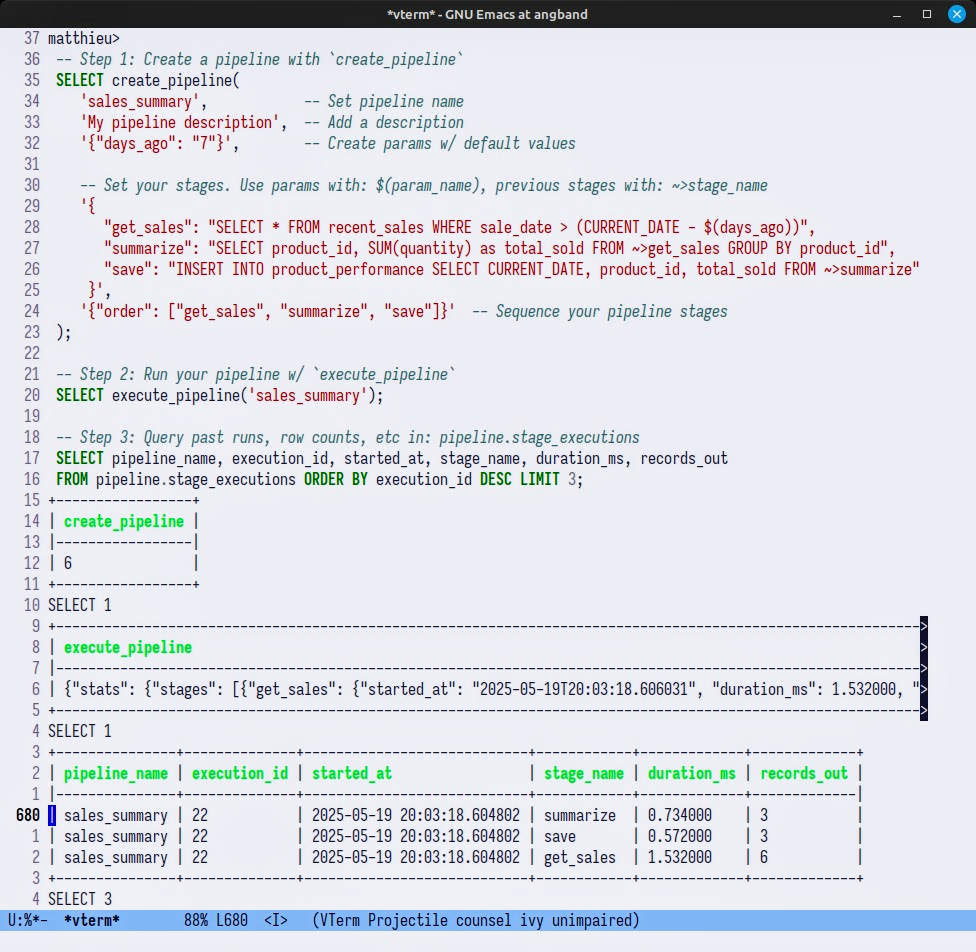

<p align="center">
  
</p>

#  pg_pipeline
**Write pipelines inside Postgres** 

A lightweight PostgresQL library to build, store and run pipelines directly in your database 🐘🪄

## Features
- Simple JSON-based pipeline definition
- Zero dependencies, no external tools
- Config-driven pipelines
- Reference previous stage results with `~>`
- Execution stats, row counts for free

## Get started
Just run the SQL script to install the extension:
```sql
\i pg_pipeline.sql
```

## Of Note...
Ultimately, **pg_pipeline** is just a few tiny PL/pgSQL functions which let you stitch pipelines out of config-driven queries in a tidy JSON (with some extra niceties like execution stats and `~>` syntax).

Prematurely reaching towards workflow schdulers and cluster-compute engines pulls data teams into a quagmire.

**pg_pipeline** caters to the 90%, where all your data lives in your DB, and you want to get started with simple, no-frills OLAP.

## Core Concepts
There are just 4 things to know...
### Pipeline
A pipeline consists of 5 keys in a json:

- `name` + `description`: For identification
- `parameters`: Configurable values with defaults
- `stages`: Individual SQL operations to be performed
- `flow`: The order of execution

### Stage
Each stage in your pipeline produces a temporary result table that subsequent stages can reference. Use the `~>` operator to refer to output from previous stages:
```sql
SELECT * FROM ~>active_users a LEFT JOIN ~>purchases p ON a.user_id = p.user_id
```

### Parameters
Make your pipelines config-driven with `$(param_name)` syntax:
```sql
SELECT * FROM logins WHERE date > current_date - $(period)
```

### Execution

Everytime you execute a pipeline with `pipeline_execute`, run info with records processed and time-elapsed per stage
are written to the `pg_pipeline.executions` table.

